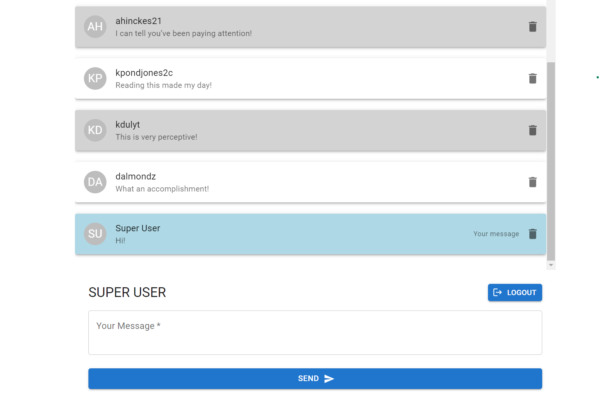

# WS-Chat 🚀

Welcome to the WS-Chat repository! 🎉

WS-Chat is a monorepo that houses the client and server parts of a WebSocket-based chat application. I embarked on this adventure alone, using the tools I had at my disposal. 🛠️

The client side of the application is developed using React and TypeScript and utilizes Vite for effective bundling. @mui/material has been chosen for UI components and user interactions. To dive into the client-side code, navigate to the `client-ts` folder.  📁

On the server side, we've built a Node.js foundation, enhanced with Express. For the exchange of messages, we rely on Socket.io. MongoDB serves as our trusty database 🗄️, with Mongoose acting as a liaison for database interactions. You can find the server-side code in the `server` folder.

Live Version 🌐
Experience our chat application in action at <https://the-chat-front.onrender.com>!

## Installation 📥

Before you set sail, ensure you have Node.js and npm installed.

### Installing Dependencies

1. Clone the repository
2. Navigate into the repository directory
3. Run `npm install` in both the `client-ts` and `server` directories

### Running the Application

- **Client**: In the `client-ts` directory, execute `npm run dev` to start in development mode.
- **Server**: In the `server` directory, execute `npm run dev` to start the server in development mode.

Note: You will need to configure environment variables as per `.env.example`.

## Scripts 💻

Each directory has its own npm scripts:

**Client**:

- `dev`: Starts the Vite server for development
- `build`: Compiles a production-ready bundle

**Server**:

- `start`: Runs the server in production mode
- `dev`: Runs the server in development mode

## Dependencies  📚

**Client**:

- React and ReactDOM
- TypeScript
- Socket.io Client
- @mui/material and @mui/icons-material
- Vite, including plugins for React
- ESLint with configurations for React

**Server**:

- Express
- MongoDB and Mongoose
- Socket.io
- Additional utilities: cors, dotenv, morgan, colors, cross-env

Feel free to explore the codebase and raise any issues or suggestions. Your journey through our WebSocket Chat Application starts now!

